# Architecture

## Boundary

MoMi backend modules share one repository and one ordered Supabase migration
history. The warehouse is the system of record. Modules communicate through
durable records, versioned views, and the MoMi-owned API rather than direct
source reads or service-to-service HTTP calls.

## Product Planes

- **MoMi** is the Dough Monster operating system and business-authority plane.
- **MoSi** is Monster Sensory Infrastructure, pronounced “mosey,” and names the
  topology-neutral shop sensory and IoT plane.
- **MoXi** is Monster Experience Interface, pronounced “moxie,” and names the
  human-interaction platform for POS, kiosk, KDS, Expo, and related surfaces.

ADR `0018` defines their exact boundaries and naming rules. Technical
identifiers use `momi`, `mosi`, and `moxi`.

```mermaid
flowchart LR
  toast["Toast Orders webhook"]
  ingest["Toast ingest"]
  reconcile["Approved reconciliation work"]
  wake["Supabase trigger adapter"]
  fetch["toast.orders.fetch_by_guid.v1"]
  toastApi["Toast Orders API"]
  events["Unchanged Toast webhook events"]
  hydrateWork["Durable hydration work"]
  versions["toast_raw.orders resource versions"]
  apiWork["momi_orders.api_invocation_work"]
  worker["Source-neutral order alert worker"]
  toastReader["Toast-specific owned order reader"]
  futureReader["Future source-specific owned reader"]
  config["Configured sources, rules, routes, destinations"]
  process["momi_alerting configured decision"]
  candidates["momi_alerting.order_alert_candidates"]
  deliveryWork["Durable Slack delivery work"]
  projections["Rebuildable related projections"]
  views["Versioned query contracts"]
  api["MoMi API"]
  consumers["MoMi clients and services"]
  delivery["Slack delivery"]
  slack["Slack channel"]

  toast --> ingest
  ingest --> events
  events --> apiWork
  reconcile --> hydrateWork
  hydrateWork --> wake
  wake --> fetch
  fetch --> toastApi
  toastApi --> fetch
  fetch --> versions
  versions --> projections
  versions --> apiWork
  apiWork --> worker
  worker -->|"exact registered contract"| toastReader
  worker -.->|"future registered contract"| futureReader
  futureReader -.->|"same owned envelope"| worker
  views --> toastReader
  toastReader -->|"payload + common presentation"| worker
  config --> process
  worker --> process
  process --> candidates
  events --> views
  projections --> views
  candidates --> views
  views --> api
  api --> consumers
  candidates --> deliveryWork
  deliveryWork --> delivery
  delivery --> slack
```

## Invariants

- Raw ingest authenticates and preserves the webhook payload unchanged.
- A webhook event and a complete order resource version are separate records.
- Ingest does not call another function or API after persistence.
- `toast.orders.fetch_by_guid.v1` is the only Toast caller in this slice.
- The primitive implements one operation and accepts no arbitrary URL or method.
- Hydration and re-hydration are idempotent, configured, and warehouse-backed.
- Reports and read requests never fetch source data or wait for hydration.
- Webhook receipt creates alert API work only after durable source persistence.
- Webhooks never queue GET-by-GUID hydration.
- Explicit hydration stores the resource version and API work atomically.
- The alert worker cannot start until the Order API work transaction commits.
- The worker resolves the exact source-specific reader route from active
  registry configuration stored with the durable work.
- Reader requests carry only work identity, order identity, and capability.
- Every source-specific reader returns the same owned metadata envelope and its
  complete source payload plus a common presentation; it never calls the source
  API.
- Raw storage is permanent and separated by source resource type.
- Every order version contains the complete source record as JSONB.
- Content hashes deduplicate unchanged records; fetch attempts remain auditable.
- GET-by-GUID and any approved bulk operation feed `toast_raw.orders`.
- Related and query projections rebuild entirely from owned resource versions.
- No recovery or rebuild process may require Toast to remain available.
- Square uses its own raw resource tables without rewriting Toast history.
- Downstream reads use named, versioned query contracts through the MoMi API.
- Application code and the MoMi API do not query raw source tables directly.
- Modules coordinate through durable database work. The only internal HTTP hop
  in this slice is the ADR-approved worker call to the exact owned reader.
- A Supabase-native adapter may wake an allowlisted Edge Function after commit.
- Adapter requests carry work identity and its private per-work capability token.
- The function verifies the token while atomically reclaiming durable work.
- Duplicate or missed wake-ups are recovered from database state.
- Business mappings and enable switches live in database configuration.
- Source, rule, route, and destination enablement are independent controls.
- Alert identity includes source system, order id, alert kind, and destination.
- Alert claims are durable before notification delivery is attempted.
- Alert claims snapshot readable order presentation before delivery work.
- Destination payloads omit source GUIDs when readable identities exist.
- Slack calls never occur inside a source ingestion request.
- Delivery adapters send durable outcomes and never fetch business data.
- Cross-source relationships use explicit views or contracts, not raw foreign keys.

## Repository Shape

- `supabase/functions/<slug>/` contains only a thin Edge deployment adapter.
- `services/<service-key>/` owns capability code, contracts, tests, and docs.
- `supabase/migrations/` is the single migration history for the shared project.
- `packages/<package-name>/` contains shared code and is never deployable itself.
- One capability service may own multiple cohesive Edge Function entrypoints.
- Separate repositories are reserved for independently versioned product surfaces.
