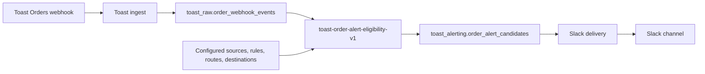

# Architecture

## Boundary

MoMi backend modules share one repository and one ordered Supabase migration
history. Each module keeps a narrow runtime boundary and communicates through
durable database records or explicit contracts.

## Invariants

- Raw ingest performs authentication and source-preserving persistence only.
- Business mappings and enable switches live in database configuration.
- Source, rule, route, and destination enablement are independent controls.
- Alert claims are durable before notification delivery is attempted.
- Slack calls never occur inside a source ingestion request.
- Cross-source relationships use explicit views or contracts, not raw foreign keys.

## Repository Shape

- `supabase/functions/<service-name>/` contains one deployable Edge service.
- `services/<service-name>/` contains one deployable non-Edge service.
- `supabase/migrations/` is the single migration history for the shared project.
- `packages/<package-name>/` contains shared code and is never deployable itself.
- No directory contains entrypoints for two independently deployable services.
- Separate repositories are reserved for independently versioned product surfaces.
