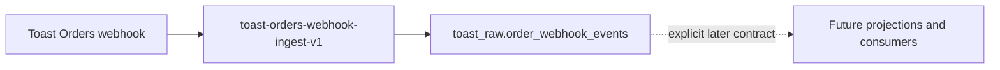

# Architecture

## Boundary

This service ends when an authenticated Toast event is durably stored.
Downstream projections and notifications consume stored events separately.

## Invariants

- The receiver is public because Toast cannot send a Supabase JWT.
- Every POST is authenticated with Toast's HMAC-SHA256 signature.
- Signature verification uses the exact request body plus Toast timestamp.
- The complete JSON payload and all received headers are stored.
- Repeated event GUIDs acknowledge successfully without a second row.
- Database failure returns a retryable server error instead of acknowledging loss.
- No Slack call occurs in the ingestion request.

## Data Shape

The raw table has only ingestion metadata, request headers, and source payload.
Source fields remain inside the payload. Future views may expose fields without
changing or duplicating the raw record.
