# Architecture

## Boundary

MoMi backend modules share one repository and one ordered Supabase migration
history. The warehouse is the system of record. Modules communicate through
durable records, versioned views, and the MoMi-owned API rather than direct
source reads or service-to-service HTTP calls.

```mermaid
flowchart LR
  toast["Toast Orders webhook"]
  ingest["Toast ingest"]
  schedule["Configured hydration schedule"]
  hydrate["Toast hydration adapter"]
  toastApi["Toast source API"]
  events["Toast raw webhook events"]
  snapshots["Toast raw order snapshots"]
  hydrateWork["Durable hydration work"]
  apiWork["Durable Order API work"]
  invoker["MoMi Order API invoker"]
  config["Configured sources, rules, routes, destinations"]
  process["Warehouse decision processing"]
  candidates["toast_alerting.order_alert_candidates"]
  views["Versioned warehouse views"]
  api["MoMi API"]
  consumers["MoMi clients and services"]
  delivery["Slack delivery"]
  slack["Slack channel"]

  toast --> ingest
  ingest --> events
  events --> hydrateWork
  schedule --> hydrateWork
  hydrateWork --> hydrate
  hydrate --> toastApi
  toastApi --> hydrate
  hydrate --> snapshots
  snapshots --> apiWork
  apiWork --> invoker
  invoker --> api
  config --> process
  api --> process
  process --> candidates
  events --> views
  snapshots --> views
  candidates --> views
  views --> api
  api --> consumers
  candidates --> delivery
  delivery --> slack
```

## Invariants

- Raw ingest performs authentication and source-preserving persistence only.
- Ingest does not call another function or API after persistence.
- Only a hydration adapter processing durable work may call a source API.
- Hydration and re-hydration are idempotent, configured, and warehouse-backed.
- Reports and read requests never fetch source data or wait for hydration.
- Webhook receipt queues hydration only after durable source persistence.
- Hydration completion stores the snapshot and Order API work atomically.
- The Order API invoker cannot start until that transaction commits.
- The Order API invoker starts from durable work and passes the order GUID only.
- Downstream reads use named, versioned views through the MoMi API.
- Application code and the MoMi API do not query raw source tables directly.
- Internal processing is triggered from durable warehouse work, not HTTP chains.
- Business mappings and enable switches live in database configuration.
- Source, rule, route, and destination enablement are independent controls.
- Alert claims are durable before notification delivery is attempted.
- Slack calls never occur inside a source ingestion request.
- Delivery adapters send durable outcomes and never fetch business data.
- Cross-source relationships use explicit views or contracts, not raw foreign keys.

## Repository Shape

- `supabase/functions/<service-name>/` contains one deployable Edge service.
- `services/<service-name>/` contains one deployable non-Edge service.
- `supabase/migrations/` is the single migration history for the shared project.
- `packages/<package-name>/` contains shared code and is never deployable itself.
- No directory contains entrypoints for two independently deployable services.
- Separate repositories are reserved for independently versioned product surfaces.
