# Architecture

## Boundary

MoMi backend modules share one repository and one ordered Supabase migration
history. The warehouse is the system of record. Modules communicate through
durable records, versioned views, and the MoMi-owned API rather than direct
source reads or service-to-service HTTP calls.

```mermaid
flowchart LR
  toast["Toast Orders webhook"]
  ingest["Toast ingest"]
  schedule["Configured hydration schedule"]
  wake["Supabase trigger adapter"]
  fetch["toast.orders.fetch_by_guid.v1"]
  toastApi["Toast Orders API"]
  events["Unchanged Toast webhook events"]
  hydrateWork["Durable hydration work"]
  versions["toast_raw.orders resource versions"]
  apiWork["Durable Order API work"]
  invoker["MoMi Order API invoker"]
  config["Configured sources, rules, routes, destinations"]
  process["Warehouse decision processing"]
  candidates["toast_alerting.order_alert_candidates"]
  projections["Rebuildable related projections"]
  views["Versioned query contracts"]
  api["MoMi API"]
  consumers["MoMi clients and services"]
  delivery["Slack delivery"]
  slack["Slack channel"]

  toast --> ingest
  ingest --> events
  events --> hydrateWork
  schedule --> hydrateWork
  hydrateWork --> wake
  wake --> fetch
  fetch --> toastApi
  toastApi --> fetch
  fetch --> versions
  versions --> projections
  versions --> apiWork
  apiWork --> invoker
  invoker --> api
  config --> process
  api --> process
  process --> candidates
  events --> views
  projections --> views
  candidates --> views
  views --> api
  api --> consumers
  candidates --> delivery
  delivery --> slack
```

## Invariants

- Raw ingest authenticates and preserves the webhook payload unchanged.
- A webhook event and a complete order resource version are separate records.
- Ingest does not call another function or API after persistence.
- `toast.orders.fetch_by_guid.v1` is the only Toast caller in this slice.
- The primitive implements one operation and accepts no arbitrary URL or method.
- Hydration and re-hydration are idempotent, configured, and warehouse-backed.
- Reports and read requests never fetch source data or wait for hydration.
- Webhook receipt queues hydration only after durable source persistence.
- Hydration completion stores the resource version and API work atomically.
- The Order API invoker cannot start until that transaction commits.
- The Order API invoker starts from durable work and passes the order GUID only.
- Raw storage is permanent and separated by source resource type.
- Every order version contains the complete source record as JSONB.
- Content hashes deduplicate unchanged records; fetch attempts remain auditable.
- GET-by-GUID and any approved bulk operation feed `toast_raw.orders`.
- Related and query projections rebuild entirely from owned resource versions.
- No recovery or rebuild process may require Toast to remain available.
- Square uses its own raw resource tables without rewriting Toast history.
- Downstream reads use named, versioned query contracts through the MoMi API.
- Application code and the MoMi API do not query raw source tables directly.
- Modules coordinate only through durable database work, never HTTP chains.
- A Supabase-native adapter may wake an allowlisted Edge Function after commit.
- Adapter requests carry work identity only; the function reclaims durable work.
- Duplicate or missed wake-ups are recovered from database state.
- Business mappings and enable switches live in database configuration.
- Source, rule, route, and destination enablement are independent controls.
- Alert claims are durable before notification delivery is attempted.
- Slack calls never occur inside a source ingestion request.
- Delivery adapters send durable outcomes and never fetch business data.
- Cross-source relationships use explicit views or contracts, not raw foreign keys.

## Repository Shape

- `supabase/functions/<service-name>/` contains one deployable Edge service.
- `services/<service-name>/` contains one deployable non-Edge service.
- `supabase/migrations/` is the single migration history for the shared project.
- `packages/<package-name>/` contains shared code and is never deployable itself.
- No directory contains entrypoints for two independently deployable services.
- Separate repositories are reserved for independently versioned product surfaces.
